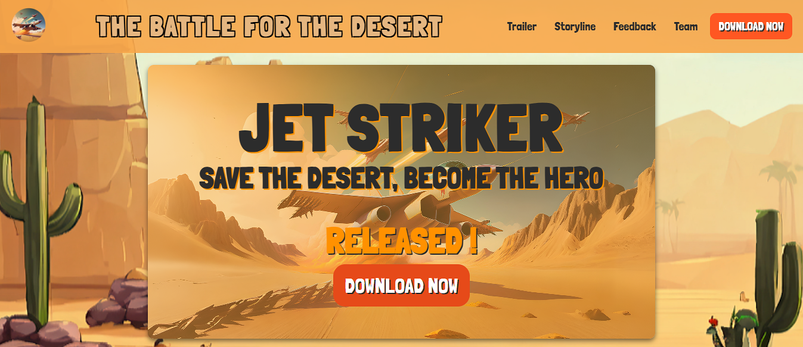

# Jet Striker Game Landing Page
## 🚀 Overview
A sleek and responsive landing page for the Jet Striker game, built using **HTML**, **CSS**, and **JavaScript**. The page includes game previews, platform-specific download options, and a contact form powered by **Formspree**.

 

## 🚀 Screenshots

 

## 🚀 Features
- **Image Slider:** A rotating display of high-quality game visuals.
- **Download Options:** Clear buttons for downloading the game on **Windows** and **Android**.
- **Hidden Containers:** Interactive elements for a clean and engaging user experience when downloading the game.
- **Team Information:** Popup displaying details about the development team.
- **Responsive Design:** The page adapts seamlessly to various screen sizes.
- **Contact Form:** Integrated **Formspree** to handle form submissions without requiring a backend.

 

## 🚀 Tech Stack
- HTML5
- CSS3
- JavaScript
- [Formspree](https://formspree.io/) for form submission

 

## 🚀 Deployment
The app is deployed on <b>Netlify</b> and can be accessed via:
 
https://jetstriker.netlify.app/

 

## 🚀 Contact
- LinkedIn: www.linkedin.com/in/ibadhussain